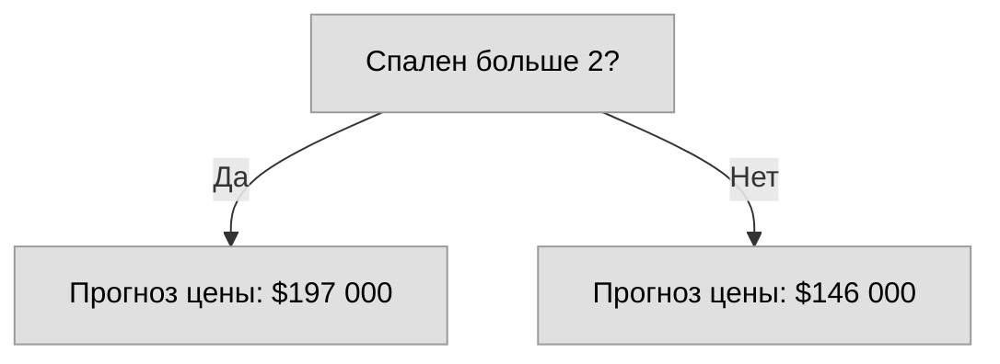
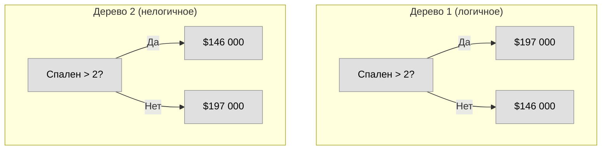
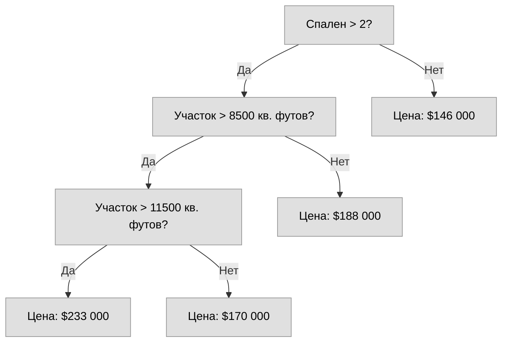

# Как работают модели

## Введение

Начнём с обзора того, как работают модели машинного обучения и как их используют. Если ты уже занимался статистическим моделированием или ML раньше, это может показаться базовым. Не переживай — скоро мы перейдём к построению мощных моделей.

В этом курсе ты будешь строить модели по следующему сценарию:

**Твой кузен заработал миллионы на спекуляциях с недвижимостью. Он предложил тебе стать деловыми партнёрами, потому что ты интересуешься Data Science. Он даёт деньги, а ты — модели, предсказывающие стоимость различных домов.**

Ты спрашиваешь кузена, как он предсказывал стоимость недвижимости раньше. Он говорит: «просто интуиция». Но дальнейшие расспросы показывают, что он замечал ценовые паттерны в домах, которые видел в прошлом, и использовал их для предсказаний по новым домам.

**Машинное обучение работает точно так же.** Мы начнём с модели под названием **Decision Tree** (Дерево решений). Есть более сложные модели с более точными предсказаниями, но деревья решений легко понять, и они — базовый строительный блок для одних из лучших моделей в Data Science.

Для простоты начнём с самого простого дерева решений.

---

## Первое дерево решений

Дерево делит дома всего на две категории. Предсказанная цена для любого рассматриваемого дома — это историческая средняя цена домов в той же категории.

Мы используем данные, чтобы решить, как разбить дома на две группы, а затем — чтобы определить предсказанную цену в каждой группе. Этот шаг выявления паттернов из данных называется **fitting** или **training** модели (обучение). Данные, используемые для обучения, называются **training data** (обучающие данные).

Детали того, как именно модель обучается (например, как разделять данные) достаточно сложны — мы отложим их на потом. После обучения модель можно **применить к новым данным** для предсказания цен на другие дома.

*Рис. 1 – Простейшее дерево решений с одним разбиением (Depth 1)*

---

## Улучшаем дерево решений

Какое из двух деревьев ниже с большей вероятностью получится при обучении на данных о недвижимости?

**Дерево решений 1 (справа)** вероятно, имеет больше смысла, потому что оно отражает реальность: дома с большим количеством спален обычно продаются дороже. Главный недостаток этой модели — она **не учитывает большинство факторов**, влияющих на цену: количество ванных комнат, размер участка, местоположение и т.д.

**Дерево решений 2 (слева)** противоречит рыночной логике, поэтому оно маловероятно при обучении на реальных данных.

*Рис. 2 – Сравнение двух возможных деревьев (оба глубины 1)*

Можно учесть больше факторов, используя дерево с большим количеством **«разбиений» (splits)**. Такие деревья называют **«более глубокими» (deeper)**. Дерево, которое также учитывает размер участка, выглядит так:

*Рис. 3 – Более глубокое дерево (Depth 2) с учётом размера участка*

Ты предсказываешь цену любого дома, проходя по дереву решений и всегда выбирая путь, соответствующий характеристикам дома. Предсказанная цена находится внизу дерева. Точка внизу, где делается предсказание, называется **leaf** (лист).

Разбиения и значения в листьях **определяются данными**, так что пора взглянуть на данные, с которыми ты будешь работать.