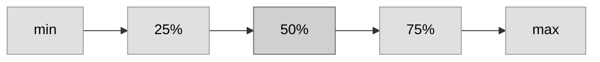
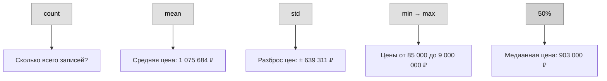

# Базовое исследование данных

## Загрузка и понимание твоих данных

## Используем Pandas для знакомства с данными

**Первый шаг в любом проекте машинного обучения — познакомиться с данными.** Для этого мы будем использовать библиотеку Pandas. Pandas — это основной инструмент, который data scientists используют для исследования и обработки данных. Большинство людей сокращают pandas в коде как `pd`. Мы делаем это командой:

```python
import pandas as pd
```

Самая важная часть библиотеки Pandas — это **DataFrame**. DataFrame хранит данные, которые можно представить как таблицу. Это похоже на лист в Excel или таблицу в SQL-базе данных.

У Pandas есть мощные методы для большинства задач, которые тебе понадобятся при работе с таким типом данных.

В качестве примера мы посмотрим на данные о ценах на дома в Мельбурне, Австралия. В практических упражнениях ты применишь те же процессы к новому датасету с ценами на дома в Айове.

Пример данных (Мельбурн) находится по пути:  
`../input/melbourne-housing-snapshot/melb_data.csv`

Мы загружаем и исследуем данные следующими командами:

```python
# сохраняем путь к файлу в переменную для удобства
melbourne_file_path = '../input/melbourne-housing-snapshot/melb_data.csv'
# читаем данные и сохраняем в DataFrame с названием melbourne_data
melbourne_data = pd.read_csv(melbourne_file_path)
# выводим сводку по данным Мельбурна
melbourne_data.describe()
```

---

## Интерпретация описания данных

Результат `describe()` показывает **8 чисел для каждого столбца** в исходном датасете.

| Параметр | Описание |
|----------|----------|
| **count** | Количество строк с непустыми значениями |
| **mean** | Среднее арифметическое |
| **std** | Стандартное отклонение — насколько сильно значения разбросаны |
| **min** | Минимальное значение (0-й процентиль) |
| **25%** | 25-й процентиль — значение, больше которого 75% данных |
| **50%** | 50-й процентиль (медиана) — середина данных |
| **75%** | 75-й процентиль — значение, больше которого 25% данных |
| **max** | Максимальное значение (100-й процентиль) |

---

### Что значат эти числа?

Первое число, **count** (количество), показывает, сколько строк имеют непустые значения.

**Пропущенные значения (missing values)** возникают по многим причинам. Например, размер второй спальни не будут собирать при опросе о доме с одной спальней. Мы ещё вернёмся к теме пропущенных данных.

Второе значение — **mean** (среднее). Под ним **std** — стандартное отклонение, которое измеряет, насколько численно разбросаны значения.

Чтобы понять значения **min, 25%, 50%, 75% и max**, представь, что ты отсортировал каждый столбец от наименьшего значения к наибольшему:

- Первое (самое маленькое) значение — это **min**.
- Если пройдёшь четверть списка, найдёшь число, которое больше 25% значений и меньше 75% значений — это **25-й процентиль**.
- **50-й** и **75-й процентили** определяются аналогично.
- **max** — самое большое число.



*Рис. 1 – Распределение данных от минимума до максимума с процентилями*

---

### Пример: данные Мельбурна

Вот как выглядит вывод `describe()` для мельбурнского датасета:

|       | Rooms | Price      | Distance | Postcode | Bedroom2 | Bathroom | Car   | Landsize | BuildingArea | YearBuilt | Lattitude | Longtitude | Propertycount |
|-------|-------|------------|----------|----------|----------|----------|-------|----------|--------------|-----------|-----------|------------|---------------|
| count | 13580 | 13580      | 13580    | 13580    | 13580    | 13580    | 13518 | 13580    | 7130         | 8205      | 13580     | 13580      | 13580         |
| mean  | 2.94  | 1 075 684  | 10.14    | 3105.30  | 2.91     | 1.53     | 1.61  | 558.42   | 151.97       | 1964.68   | -37.81    | 144.99     | 7454.42       |
| std   | 0.96  | 639 311    | 5.87     | 90.68    | 0.97     | 0.69     | 0.96  | 3990.67  | 541.01       | 37.27     | 0.08      | 0.10       | 4378.58       |
| min   | 1     | 85 000     | 0        | 3000     | 0        | 0        | 0     | 0        | 0            | 1196      | -38.18    | 144.43     | 249           |
| 25%   | 2     | 650 000    | 6.1      | 3044     | 2        | 1        | 1     | 177      | 93           | 1940      | -37.86    | 144.93     | 4380          |
| 50%   | 3     | 903 000    | 9.2      | 3084     | 3        | 1        | 2     | 440      | 126          | 1970      | -37.80    | 145.00     | 6555          |
| 75%   | 3     | 1 330 000  | 13       | 3148     | 3        | 2        | 2     | 651      | 174          | 1999      | -37.76    | 145.06     | 10331         |
| max   | 10    | 9 000 000  | 48.1     | 3977     | 20       | 8        | 10    | 433 014  | 44 515       | 2018      | -37.41    | 145.53     | 21650         |

---

## Как читать эту таблицу



*Рис. 2 – Ключевые показатели describe() на примере столбца Price*

---

## Твоя очередь

Приступай к своему первому упражнению по написанию кода.

Есть вопросы или комментарии? Посети форум курса, чтобы пообщаться с другими учениками.

### Подумай о своих данных

Самый новый дом в данных не такой уж новый. Возможные объяснения:

1.  **В районе перестали строить новые дома.**
2.  **Данные были собраны давно.** Дома, построенные позже, в датасет не попали.

#### Вопросы для размышления

- Если верно объяснение №1, стоит ли доверять модели, построенной на этих данных?
- А если верно объяснение №2?
- Как можно покопаться в данных, чтобы понять, какое объяснение правдоподобнее?

#### Ключевые мысли из обсуждения

**Если верно объяснение №1 (новые дома не строятся):**

- Данные всё ещё могут отражать **текущую ситуацию** на рынке. Модели можно доверять, но с оговоркой: она не сможет предсказать цену на дома нового типа, которых нет в данных.
- Сам факт остановки строительства — это важный сигнал. Возможно, в районе произошли события (закрылся завод, изменился спрос), которые делают любые прогнозы на основе прошлого ненадёжными. Стоит понять причину, а не просто использовать данные как есть.

**Если верно объяснение №2 (данные устарели):**

- Это **серьёзная проблема**. Рынок недвижимости сильно меняется со временем (инфляция, спрос, мода). Модель на старых данных не учтёт эти тренды и будет давать неточные предсказания для сегодняшнего дня.
- Модель всё ещё может улавливать базовые закономерности (дом с 4 спальнями дороже, чем с 2 спальнями), но для точного предсказания **цены** её использовать нельзя.

**Как докопаться до истины (что проверить в данных):**

- Посмотри на столбец **`YrSold`** (год продажи). Если год продажи недавний, а год постройки (`YearBuilt`) старый — значит, дома продаются и сейчас, просто новые не строятся (объяснение №1).
- Если же и год продажи, и год постройки заканчиваются 2010 годом — это явный признак того, что данные просто перестали собирать (объяснение №2).
- Можно также посмотреть на столбцы с годом ремонта (**`YearRemodAdd`**). Если ремонты тоже не проводились после 2010, это ещё один аргумент в пользу устаревших данных.

**Вывод:**

Чаще всего в таких учебных датасетах причина в устаревших данных (объяснение №2). Это значит, что для обучения навыкам работы с моделью данные подходят, но для реальных бизнес-прогнозов — нет. Нужны были бы свежие данные.