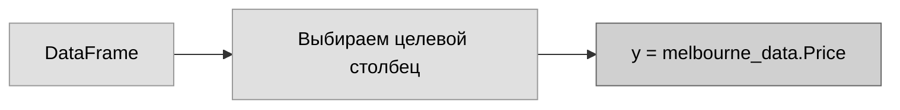
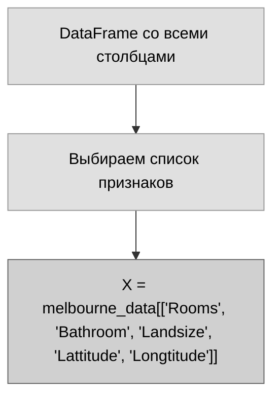
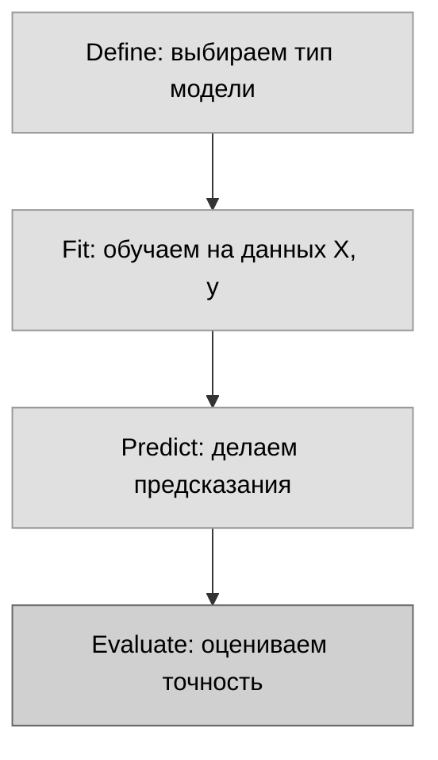

# Твоя первая модель машинного обучения

## Строим первую модель. Ура!

---

## Выбор данных для моделирования

Твой датасет содержит слишком много переменных, чтобы охватить их все разом или даже просто аккуратно вывести. Как сжать этот огромный объём данных до чего-то понятного?

Мы начнём с выбора нескольких переменных на основе интуиции. В следующих курсах ты узнаешь статистические методы для автоматического определения важности переменных.

Чтобы выбрать переменные (столбцы), нужно увидеть список всех столбцов в датасете. Это делается с помощью свойства `columns` объекта DataFrame.

```python
import pandas as pd

melbourne_file_path = '../input/melbourne-housing-snapshot/melb_data.csv'
melbourne_data = pd.read_csv(melbourne_file_path)
melbourne_data.columns
```

Вывод:
```
Index(['Suburb', 'Address', 'Rooms', 'Type', 'Price', 'Method', 'SellerG',
       'Date', 'Distance', 'Postcode', 'Bedroom2', 'Bathroom', 'Car',
       'Landsize', 'BuildingArea', 'YearBuilt', 'CouncilArea', 'Lattitude',
       'Longtitude', 'Regionname', 'Propertycount'],
      dtype='object')
```

В мельбурнских данных есть пропущенные значения (для некоторых домов не все переменные записаны). Мы научимся обрабатывать пропуски позже. В данных по Айове пропусков в используемых столбцах нет, поэтому пока просто удалим строки с пропусками из мельбурнских данных:

```python
# dropna удаляет пропущенные значения (na = "not available")
melbourne_data = melbourne_data.dropna(axis=0)
```

Существует много способов выбрать подмножество данных. В курсе Pandas они разбираются подробнее, а мы пока сосредоточимся на двух подходах:

- **Через точку (dot-notation)** — для выбора целевой переменной (prediction target)
- **Через список столбцов** — для выбора признаков (features)

---

## Выбор целевой переменной (Prediction Target)

Ты можешь извлечь столбец с помощью записи через точку. Такой одиночный столбец хранится в объекте **Series**, который похож на DataFrame, но содержит только один столбец данных.

Мы используем точечную нотацию, чтобы выбрать столбец, который хотим предсказать — **prediction target**. По соглашению целевая переменная обозначается буквой **y**. Код для сохранения цен на дома в Мельбурне:

```python
y = melbourne_data.Price
```



*Рис. 1 – Извлечение целевой переменной y через dot-notation*

---

## Выбор признаков (Features)

Столбцы, которые подаются на вход модели (и позже используются для предсказания), называются **features** (признаки). В нашем случае это характеристики, по которым мы определяем цену дома.

Иногда в качестве признаков используют все столбцы, кроме целевого. В других случаях лучше обойтись меньшим числом признаков.

Пока мы построим модель всего на нескольких признаках. Позже ты увидишь, как сравнивать модели с разными наборами признаков.

Мы выбираем несколько признаков, передавая список названий столбцов в квадратных скобках. Каждый элемент списка — строка (в кавычках).

Пример:

```python
melbourne_features = ['Rooms', 'Bathroom', 'Landsize', 'Lattitude', 'Longtitude']
```

По соглашению эти данные обозначают буквой **X**.

```python
X = melbourne_data[melbourne_features]
```



*Рис. 2 – Формирование матрицы признаков X*

Быстро оценим данные, которые будем использовать для предсказания цен, с помощью методов `describe` и `head` (показывает первые несколько строк).

```python
X.describe()
```

|       | Rooms | Bathroom | Landsize | Lattitude | Longtitude |
|-------|-------|----------|----------|-----------|------------|
| count | 6196  | 6196     | 6196     | 6196      | 6196       |
| mean  | 2.93  | 1.58     | 471.01   | -37.81    | 144.99     |
| std   | 0.97  | 0.71     | 897.45   | 0.08      | 0.10       |
| min   | 1     | 1        | 0        | -38.16    | 144.54     |
| 25%   | 2     | 1        | 152      | -37.86    | 144.93     |
| 50%   | 3     | 1        | 373      | -37.80    | 145.00     |
| 75%   | 4     | 2        | 628      | -37.76    | 145.05     |
| max   | 8     | 8        | 37000    | -37.46    | 145.53     |

```python
X.head()
```

|    | Rooms | Bathroom | Landsize | Lattitude | Longtitude |
|----|-------|----------|----------|-----------|------------|
| 1  | 2     | 1.0      | 156.0    | -37.8079  | 144.9934   |
| 2  | 3     | 2.0      | 134.0    | -37.8093  | 144.9944   |
| 4  | 4     | 1.0      | 120.0    | -37.8072  | 144.9941   |
| 6  | 3     | 2.0      | 245.0    | -37.8024  | 144.9993   |
| 7  | 2     | 1.0      | 256.0    | -37.8060  | 144.9954   |

**Визуальная проверка данных** с помощью этих команд — важная часть работы data scientist. Ты часто будешь находить в датасете сюрпризы, требующие дальнейшего изучения.

---

## Построение модели

Для создания моделей ты будешь использовать библиотеку **scikit-learn** (в коде она пишется как `sklearn`). Это самая популярная библиотека для моделирования данных, которые обычно хранятся в DataFrames.

Шаги построения и использования модели:

1. **Define (Определить):** Какого типа будет модель? Дерево решений? Другой тип? Также задаются некоторые другие параметры модели.
2. **Fit (Обучить):** Уловить закономерности из предоставленных данных. Это сердце моделирования.
3. **Predict (Предсказать):** Сделать предсказания.
4. **Evaluate (Оценить):** Определить, насколько точны предсказания модели.



*Рис. 3 – Четыре шага построения модели*

Пример определения модели дерева решений с помощью scikit-learn и её обучения на признаках и целевой переменной:

```python
from sklearn.tree import DecisionTreeRegressor

# Определяем модель. Указываем random_state, чтобы получать одинаковые результаты при каждом запуске
melbourne_model = DecisionTreeRegressor(random_state=1)

# Обучаем модель
melbourne_model.fit(X, y)
```

Вывод:
```
DecisionTreeRegressor(random_state=1)
```

Многие алгоритмы машинного обучения допускают элемент случайности в обучении. Указание числа для `random_state` гарантирует одинаковые результаты при каждом запуске. Это считается хорошей практикой. Число можно выбрать любое, и качество модели не будет значимо зависеть от того, какое именно значение ты выбрал.

Теперь у нас есть обученная модель, которую можно использовать для предсказаний.

На практике ты будешь делать предсказания для новых домов, поступающих на рынок, а не для тех, на которых модель обучалась. Но чтобы увидеть, как работает функция `predict`, мы сделаем предсказания для первых нескольких строк обучающих данных.

```python
print("Making predictions for the following 5 houses:")
print(X.head())
print("The predictions are")
print(melbourne_model.predict(X.head()))
```

Вывод:
```
Making predictions for the following 5 houses:
   Rooms  Bathroom  Landsize  Lattitude  Longtitude
1      2       1.0     156.0   -37.8079    144.9934
2      3       2.0     134.0   -37.8093    144.9944
4      4       1.0     120.0   -37.8072    144.9941
6      3       2.0     245.0   -37.8024    144.9993
7      2       1.0     256.0   -37.8060    144.9954
The predictions are
[1035000. 1465000. 1600000. 1876000. 1636000.]
```

---

## Твоя очередь

Попробуй сам в упражнении **Model Building Exercise**.

Есть вопросы или комментарии? Посети форум курса, чтобы пообщаться с другими учениками.